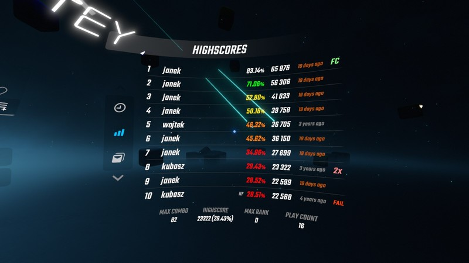

# SoloParty

Beat Saber mod for per-player scores and local leaderboard in Solo mode.



## Description

This mod allows tracking individual players' scores locally, just like in Party mode.

It also contains a local leaderboard for checking out all recorded scores in a convenient way.

**NOTE:** this mod works best if used together with SongPlayHistory.

## Features

### Per-player score tracking

- After finishing a level you're asked to choose or enter your name.
- The exact behavior of the name selector is customizable.
- Can be disabled if you only want to use the leaderboard feature.
- Optionally, use the chosen player's high score on the level results screen (instead of the global high score).

### Local leaderboard

- Showing each player's name, game modifiers, accuracy (%), score, play date and miss/bad cuts count.
- More info available after hovering over a particular cell, such as: rank name, max combo, pause count, note jump offset, exact date, good cuts count.
- Supports displaying scores from SongPlayHistory and Party mode leaderboards (base game built-in).
- Sorting records by date, highest score or good cuts count.
- Unlimited count of records, supports page up/down buttons.

## Importing scores

Score records from other sources (SongPlayHistory, Party leaderboards) will be displayed by default, but can be disabled if desired.

To support more features of the mod, scores can be imported into the mod's internal database.

**NOTE:** it is possible to use SoloParty simultaneously with other trackers, such as SongPlayHistory. Records will NOT be duplicated, but they will be merged to present as much information as possible.

Importing is possible from three sources, and the amount of metrics imported varies:

- SongPlayHistory - date/time, multiplied (raw) score, modified score, modifiers, notes passed (if failed with No Fail).
- Party leaderboards - date/time, modified score, full combo status, player names.
- BeatSaviorData - date (no time), multiplied (raw) score, modified score, modifiers, notes passed, max combo, hit/miss/bad cuts count, full combo status, total notes count.

Party leaderboards already contain player names, but other sources don't. Thus, it is possible to specify a default player name to use for all imported records.

**NOTE:** certain old versions of BeatSaviorData used to create broken records - they didn't count bad cuts *at all*. This caused the total and missed note count to be lower, but also didn't reset the score multiplier after each bad cut. This resulted in the final score being much higher than it really was - sometimes by 1000s or 10,000s! Use caution when importing BeatSaviorData records from ca. 2022.

A backup of the `SoloPartyData.json` database is created in the `UserData` directory before every import operation. Importing can be done several times, it will not mess up the database.

## Mod settings

To fine-tune the mod's behavior and to import scores, a BSML settings screen is created:


- `Enable mod` - enables/disables all features of the mod. Without this, it's almost as if the mod was not installed.
- `Track and save level completion results` - enable tracking and saving level completion scores into the mod's internal database. Without this, no records will be created, so the mod will only really be a local leaderboard.
- `Enable Party mode player chooser in Solo` - ask for the player's name after completing a level. Without this, records will still be saved, but without player names.

### Leaderboard options

- `Show scores from Party mode leaderboard` - load scores from Party mode and show on the leaderboard. An alternative is the `Import all` button, but both can be used simultaneously.
- `Show scores from SongPlayHistory` - load scores from SongPlayHistory and show on the leaderboard. An alternative is the `Import all` button, but both can be used simultaneously.
- `Show player name in SongPlayHistory scores` - prepend SongPlayHistory's tooltip UI with the player name, if available. Note that this will in reality only work for a) SoloParty records saved after installing the mod, b) Party mode records if also tracked by SPH, c) SPH records imported using a default player name.
- `Show scores from BeatSaviorData` - this checkbox is always disabled; BeatSaviorData's files are too big, so the only option is importing all scores. This can take a few minutes!

When importing scores, do it in the following order: Party mode -> SongPlayHistory -> BeatSaviorData.

*Why? a) SPH scores don't have player names, b) BSD scores don't have precise date/time information.*

### Level results screen

These settings are effective after completing a level and choosing your player name - they help determine the real previous high score of that particular player.

- `Per-player high score for fireworks` - use the previous high score to play the base game's fireworks and "high score" sound effect.
- `Per-player high score difference (SPH)` - use the previous high score to calculate the score difference presented by SongPlayHistory (ScorePercentage).

### Player name chooser (Solo, Party)

These settings affect the name chooser not only in Solo, but also in Party mode.

- `Auto-accept clicked name` - automatically accept the name when clicked, without having to press "OK" on the keyboard.
- `Number of last used names to show` - increase or reduce the number of last used names that are displayed. Game default is 5.

## Acknowledgements

This mod wouldn't be possible without some other wonderful projects:

- [BeatLeader](https://github.com/BeatLeader/beatleader-mod) - inspiration for the leaderboard UI style, UI formatting, date/time utilities, and more.
- [DrinkWater](https://github.com/Sirspam/DrinkWater) - redirecting level results screen to other views.
- [SongPlayHistory](https://github.com/qe201020335/SongPlayHistory) - general JSON record format, partial score tracking, database saving utilities.
- [LocalLeaderboard-PC](https://github.com/speecil/LocalLeaderboard-PC) - pause count tracking, UI view controller setup.

## License

```
MIT License

Copyright (c) 2025 Kuba Szczodrzyński

Permission is hereby granted, free of charge, to any person obtaining a copy
of this software and associated documentation files (the "Software"), to deal
in the Software without restriction, including without limitation the rights
to use, copy, modify, merge, publish, distribute, sublicense, and/or sell
copies of the Software, and to permit persons to whom the Software is
furnished to do so, subject to the following conditions:

The above copyright notice and this permission notice shall be included in all
copies or substantial portions of the Software.

THE SOFTWARE IS PROVIDED "AS IS", WITHOUT WARRANTY OF ANY KIND, EXPRESS OR
IMPLIED, INCLUDING BUT NOT LIMITED TO THE WARRANTIES OF MERCHANTABILITY,
FITNESS FOR A PARTICULAR PURPOSE AND NONINFRINGEMENT. IN NO EVENT SHALL THE
AUTHORS OR COPYRIGHT HOLDERS BE LIABLE FOR ANY CLAIM, DAMAGES OR OTHER
LIABILITY, WHETHER IN AN ACTION OF CONTRACT, TORT OR OTHERWISE, ARISING FROM,
OUT OF OR IN CONNECTION WITH THE SOFTWARE OR THE USE OR OTHER DEALINGS IN THE
SOFTWARE.
```
